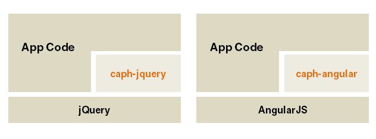
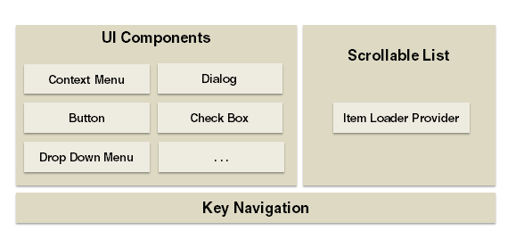

# Tizen CAPH3 App Developing Notes

### Table of Contents
-   **[Introduce](#introduce)** 
-   **[Offical Homepage Doc](#offical-homepage-doc)** 
-   **[Download](#download)** 
-   **[Developing Notes](#developing-notes)** 

## Introduce
CAPH is a web application framework which helps in easy and quick development of web apps for Samsung Smart TV. Impressive applications can be developed with the usage of CAPH. You can develop high performance web application with CAPH.

CAPH 3.0 works on jQuery, AngularJS (1.x).

CAPH 3.0 Modules.

## Offical Homepage Doc
-   [Offical Homepage](https://developer.samsung.com/onlinedocs/tv/caphdocs/index.html)
- [Getting started](https://developer.samsung.com/onlinedocs/tv/caphdocs/main.html?type=angular&doc=tutorial&p1=0)
- [Angular API](https://developer.samsung.com/onlinedocs/tv/caphdocs/main.html?type=angular&doc=jsdoc&p1=0)
- [jQuery API](https://developer.samsung.com/onlinedocs/tv/caphdocs/main.html?type=jquery&doc=jsdoc&p1=0)
- [Tizen TV’s TED app Built Using CAPH Framework](https://www.youtube.com/watch?v=sWV10UpcP5s)
-  [Report Issue]() ,  email to <caph@samsung.com> or discuss [here](https://github.com/sutaking/caph3-app-dev-notes/issues).

## Download
-   [Offical Download](https://developer.samsung.com/tv/develop/extension-libraries/caph-30/download/)
-   [Here](./download/)

## Developing Notes

-   [caph-list can not using ng-loop](./posts/caph-list.md)

